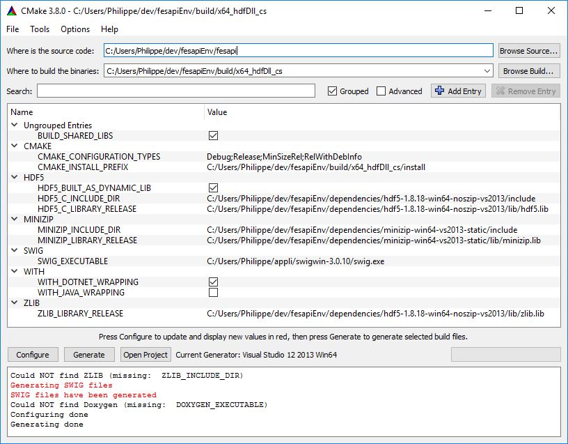

# Prepare your build environment
 - Create a folder called fesapiEnv.
 - In this folder create the three following folders
	 - build
	 - fesapi (Git clone this repository into this folder "fesapi". You should then have a path fesapiEnv/fesapi/src)
	 - dependencies
# Prepare the dependencies
Download (build and install if necessary) third party libraries:
- HDF5: All versions of 1.8.* starting from 1.8.18 should be ok. Versions 1.10.* are not supported yet (even if they should work) https://support.hdfgroup.org/ftp/HDF5/releases/hdf5-1.8/
- MINIZIP : Version 1.1 is needed : it is the official version included in current zlib distribution https://www.zlib.net/ (look into "contrib" folder). You can directly install minizip development package on most of Linux distributions (https://packages.ubuntu.com/xenial/libminizip-dev). On Windows (or older Linux distributions), you can copy the CMakeLists.txt file from fesapi/cmake/minizip to the zlib minizip directory to help you to build minizip (we also provide a copy of minizip 1.1 with cmake files on github : https://github.com/F2I-Consulting/Minizip). It is also highly recommended to link minizip to the same zlib library than the one associated to your HDF5 library.
- UUID-DEV package *(ONLY FOR LINUX)* : Source code can be found in https://www.kernel.org/pub/linux/utils/util-linux/

We advise you to install these third party libraries respectively into
- fesapiEnv/dependencies/hdf5-particularVersion
- fesapiEnv/dependencies/minizip-particularVersion
- fesapiEnv/dependencies/uuid-particularVersion (or in system directory using : sudo apt-get install uuid-dev)
# Configure the build
Fesapi uses cmake as its build tool. A 3.2 version or later of cmake is required https://cmake.org/download/. We also recommend using cmake-gui (already included in the bin folder of the binary releases of cmake) which provides a graphical user interface on top of cmake. Follow the below instructions :

- yourPath/fesapiEnv/fesapi defines where is the source code folder
- yourPath/fesapiEnv/build/theNameYouWant defines where to build the binaries
- Click on "Configure" button and select your favorite compiler : it will raise several errors.
- give real path and files to the following cmake variables:
	- HDF5
		- (ONLY FOR WINDOWS) HD5_BUILT_AS_DYNAMIC_LIB : true if you link to a shared HDF5 library else false
		- HDF5_C_INCLUDE_DIR : where the HDF5 headers are located
		- HDF5_C_LIBRARY_RELEASE : the HDF5 library you want to link to
	- MINIZIP
		- MINIZIP_INCLUDE_DIR : where the HDF5 headers are located
		- MINIZIP_LIBRARY_RELEASE : the MINIZIP library you want to link to
	- ZLIB
		- ZLIB_INCLUDE_DIR : where the zlib headers (commonly zlib.h only) are located. If you use the HDF5 binaries downloaded from HDF Group website, then it should be the same as HDF5_C_INCLUDE_DIR.
		- ZLIB_LIBRARY_RELEASE : the ZLIB library you want to link to. It must be the same as the one which is linked to HDF5 library and MINIZIP library otherwise you will get a warning from CMake. If you use the HDF5 binaries downloaded from HDF Group website, use the zlib library which lies in the same directory as HDF5_C_LIBRARY_RELEASE.
	- SZIP (it is only required when you statically link to HDF5 AND when HDF5 has been built using SZIP)
		- SZIP_LIBRARY_RELEASE : the SZIP library you want to link to. This warning can be ignored most of time but it can really create unpredictable bugs in some circumstances (static linking to HDF5 with HDF5 making use of szip).
	- UUID (ONLY FOR LINUX)
		- UUID_INCLUDE_DIR : where the UUID headers are located
		- UUID_LIBRARY_RELEASE : the UUID library you want to link to
- Click again on "Configure" button. You should no more have errors so you can now click on "Generate" button.

- You can now build your solution with your favorite compiler (and linker) using the generated solution in yourPath/fesapiEnv/build/theNameYouWant
- OPTIONALLY, you can also set the variables WITH_DOTNET_WRAPPING or WITH_JAVA_WRAPPING to true if you want to also generate wrappers on top of fesapi for these two other programming languages. Don't forget to click again on "Configure" button once you changed the value of these two variables.
	- You will then have to also provide the path to the SWIG executable http://swig.org/download.html in the SWIG_EXECUTABLE variable (and click again on "Configure" button)
	- FOR Java and only for JAVA, you'll also have to provide various path to some java executables. Still only for Java, it is highly recommended to lower the optimization level of the C++ compilation by setting O1 instead of O2 in the variables called CMAKE_CXX_FLAGS_RELEASE and CMAKE_CXX_FLAGS_RELWITHDEBINFO
	- you will find the wrappers in fesapi/java/src or fesapi/cs/src (fesapi/cs also contains a VS2013 project for the wrappers)

Remark : you can choose where fesapi will be installed (using "make install" on Linux or by generating the "INSTALL" project on Visual Studio) by setting the cmake variable called CMAKE_INSTALL_PREFIX
# Credits
This software was developed with the gSOAP toolkit from [Genivia Inc](http://genivia.com/)
