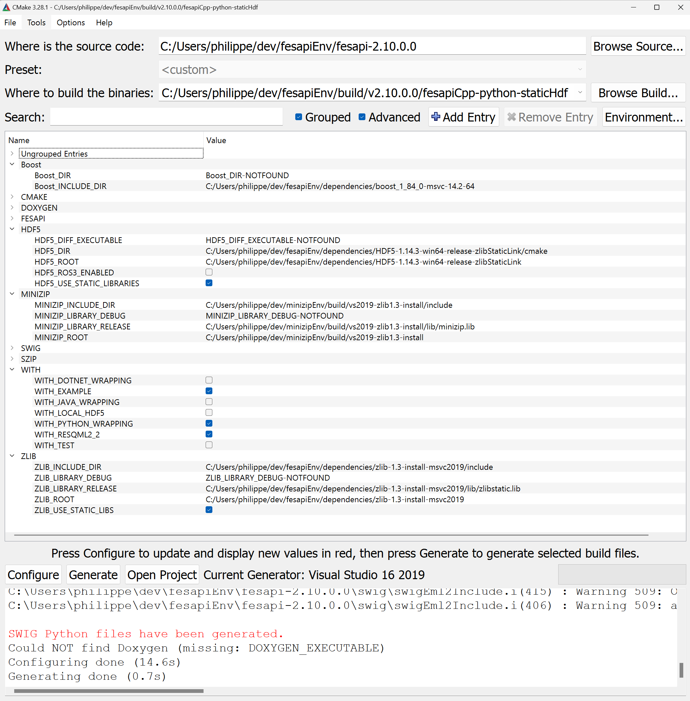

# Prepare your build environment
 - Create a folder called fesapiEnv.
 - In this folder create the three following folders
	 - build
	 - fesapi (Git clone this repository into this folder "fesapi". You should then have a path fesapiEnv/fesapi/src)
	 - dependencies 
  - The following compilers are known to work (used in CI)
    - gcc from version 4.8
	- visual studio from version 2017
	- clang from version 5.0
# Prepare the dependencies
Download (build and install if necessary) third party libraries:
- HDF5: Versions of 1.8.* (starting from 1.8.18), 1.10.* ([starting from 1.10.2](https://www.hdfgroup.org/2018/04/why-should-i-care-about-the-hdf5-1-10-2-release/)) and all 1.12.* should be ok. https://support.hdfgroup.org/ftp/HDF5/releases/
- MINIZIP : Version 1.1 is needed : it is the official version included in current zlib distribution https://www.zlib.net/ (look into "contrib" folder). You can directly install minizip development package on most of Linux distributions (https://packages.ubuntu.com/xenial/libminizip-dev). On Windows (or older Linux distributions), you can copy the CMakeLists.txt file from fesapi/cmake/minizip to the zlib minizip directory to help you to build minizip (we also provide a copy of minizip 1.1 with cmake files on github : https://github.com/F2I-Consulting/Minizip). It is also highly recommended to link minizip to the same zlib library than the one associated to your HDF5 library.
- BOOST : Starting from version 1.44.0 (and at least 1.67.0 if you don't want to face [valgrid false positives](https://www.boost.org/doc/libs/1_66_0/libs/uuid/doc/uuid.html#Design%20notes)). FYI, on windows, boost uuid depends on bcrypt library.

We advise you to install these third party libraries respectively into
- fesapiEnv/dependencies/hdf5-particularVersion
- fesapiEnv/dependencies/minizip-particularVersion
- fesapiEnv/dependencies/boost-particularVersion
# Configure the build
Fesapi uses cmake as its build tool. A 3.12 version or later of cmake is required https://cmake.org/download/. We also recommend using cmake-gui (already included in the bin folder of the binary releases of cmake) which provides a graphical user interface on top of cmake. If you want to use cmake in command line, you would find example in [Azure Pipeline file](./azure-pipelines.yml). Follow the below instructions :

- yourPath/fesapiEnv/fesapi defines where is the source code folder
- yourPath/fesapiEnv/build/theNameYouWant defines where to build the binaries
- Click on "Configure" button and select your favorite compiler : it will raise several errors.
- give real values, path and files to the following cmake variables:
	- HDF5
		- HDF5_1_8 : true if you link to a HDF5 library version 1.8 false (default) if you link to a HDF5 library version 1.10 or 1.12
		- (ONLY FOR WINDOWS) HD5_BUILT_AS_DYNAMIC_LIB : true if you link to a shared HDF5 library else false
		- HDF5_C_INCLUDE_DIR : where the HDF5 headers are located
		- (ONLY FOR WINDOWS) HDF5_C_LIBRARY_DEBUG : Optional, only used by Visual studio Debug configuration, the HDF5 debug library you want to link to .
		- HDF5_C_LIBRARY_RELEASE : the HDF5 library you want to link to. On Visual studio, it is used on Release configuration. With other compilers, it is the default HDF5 library to link to.
	- MINIZIP
		- MINIZIP_INCLUDE_DIR : where the HDF5 headers are located
		- (ONLY FOR WINDOWS) MINIZIP_LIBRARY_DEBUG : Optional, only used by Visual studio Debug configuration, the MINIZIP debug library you want to link to
		- MINIZIP_LIBRARY_RELEASE : the MINIZIP library you want to link to.  On Visual studio, it is used on Release configuration. With other compilers, it is the default HDF5 library to link to.
	- ZLIB
		- ZLIB_INCLUDE_DIR : where the zlib headers (commonly zlib.h only) are located. If you use the HDF5 binaries downloaded from HDF Group website, then it should be the same as HDF5_C_INCLUDE_DIR.
		- (ONLY FOR WINDOWS) ZLIB_LIBRARY_DEBUG : Optional, only used by Visual studio Debug configuration, the ZLIB debug library you want to link to
		- ZLIB_LIBRARY_RELEASE : the ZLIB library you want to link to. It must be the same as the one which is linked to HDF5 library and MINIZIP library otherwise you will get a warning from CMake. If you use the HDF5 binaries downloaded from HDF Group website, use the zlib library which lies in the same directory as HDF5_C_LIBRARY_RELEASE. On Visual studio, it is used on Release configuration. With other compilers, it is the default ZLIB library to link to.
	- SZIP (it is only required when you statically link to HDF5 AND when HDF5 has been built using SZIP)
		- SZIP_LIBRARY_RELEASE : the SZIP library you want to link to. This warning can be ignored most of time but it can really create unpredictable bugs in some circumstances (static linking to HDF5 with HDF5 making use of szip).
	- Boost
		- Boost_INCLUDE_DIR : where the Boost headers are located (generally the boost install folder)
- Click again on "Configure" button. You should no more have errors so you can now click on "Generate" button.

- You can now build your solution with your favorite compiler (and linker) using the generated solution in yourPath/fesapiEnv/build/theNameYouWant
- OPTIONALLY, you can build the tutorial example by setting WITH_EXAMPLE cmake variable to ON
- OPTIONALLY, you can also set the variables WITH_DOTNET_WRAPPING, WITH_JAVA_WRAPPING or WITH_PYTHON_WRAPPING to true if you want to also generate wrappers on top of FESAPI for these two other programming languages. Don't forget to click again on "Configure" button once you changed the value of these two variables.
	- You will then have to also provide the path to the SWIG (version 3 as a mininum version) executable http://swig.org/download.html in the SWIG_EXECUTABLE variable (and click again on "Configure" button)
	- FOR Java and only for JAVA, you'll also have to provide various path to some java executables. Still only for Java, it is highly recommended to lower the optimization level of the C++ compilation by setting O1 instead of O2 in the variables called CMAKE_CXX_FLAGS_RELEASE and CMAKE_CXX_FLAGS_RELWITHDEBINFO
	- you will find the wrappers in fesapi/java/src or fesapi/cs/src (fesapi/cs also contains a VS2015 project for the wrappers) or fesapi/python/src

Remark : you can choose where FESAPI will be installed (using "make install" on Linux or by generating the "INSTALL" project on Visual Studio) by setting the cmake variable called CMAKE_INSTALL_PREFIX
# How to start
As a first way to start, we advise people to look at examples provided with FESAPI. Please give a look at:
- C++ : [in example/example.cpp](./example/example.cpp)
- C# : in cs/example/example.sln (Program.cs will be generated by cmake configuration when WITH_DOTNET_WRAPPING is ON, the source file is initially located [in cmake/Program.cs](./cmake/Program.cs))
- Java (JDK 1.5 and later) : in java/src/com/f2i_consulting/example/FesapiJavaExample.java (FesapiJavaExample.java will be generated by cmake configuration when WITH_JAVA_WRAPPING is ON, the source file is initially located [in cmake/FesapiJavaExample.java](./cmake/FesapiJavaExample.java))
- Python3 (no support for Python2) : [in python/src/example.py](./python/src/example.py) (please follow instructions in the documentation header of this example python file)

You can also find Doxygen generated documentation [here](https://f2i-consulting.com/fesapi/doxygen/)
# Credits
This software was developed with :
- the gSOAP toolkit from [Genivia Inc](http://genivia.com/)
- the date library from [Howard Hinnant](https://github.com/HowardHinnant/date)

This software was tested with :
- Catch2 from [Catch Org](https://github.com/catchorg/Catch2)
- [Travis CI](https://travis-ci.org/)
- [Azure Pipelines](https://azure.microsoft.com/en-us/services/devops/pipelines/)
